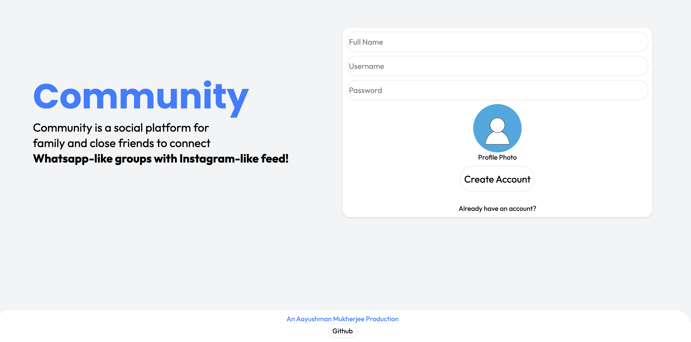
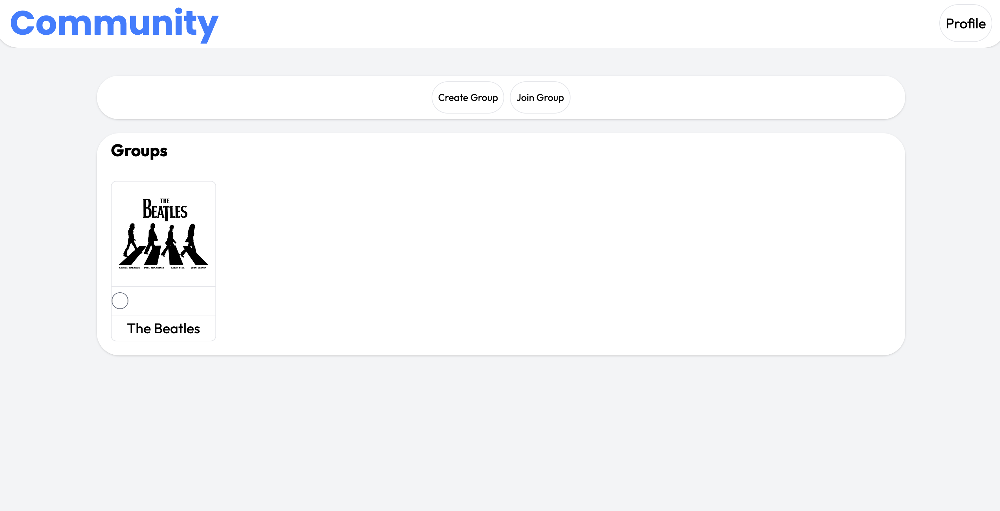
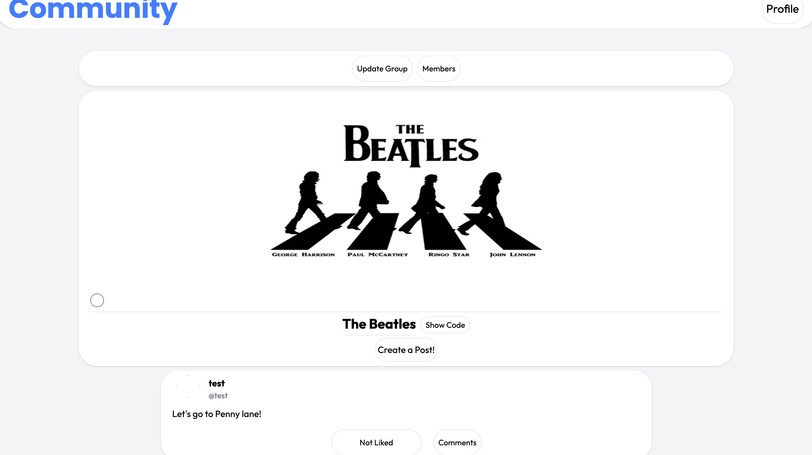
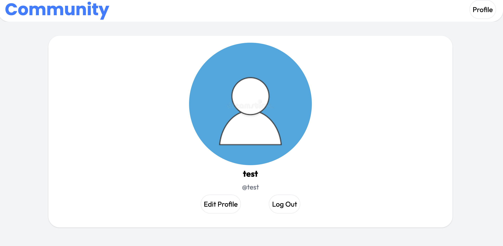

# **Community**
Community is a social platform for family and close friends to connect with Whatsapp-like groups and Instagram-like feed.

# **Preview and Guide**
## Welcome Page

- Create a new account or login to an existing account clicking on `Already have an account?`.

## All Groups Page

- Click on `Create Group` button to create a new group.
- Click on `Join Group` button to join a group by pasting the joining link.
- Click on an existing group (for example here **"The Beatles"**) to open its feed.
- Click on `Profile` button to view your profile information, edit existing information or logout.

## Group Feed Page

- Click on `Update Group` button to update group information or delete the group.
- Click on `Members` button to view, add, or remove members (only group creator can remove existing members).
- Click on `Show Code` button to view group joining code, which then can be shared with others for them to join the group using their respective `Join Group` button.
- Click on `Create a Post!` button to create a post which can contain text plus multiple images (for example here **"Let's go to Penny Lane!"**).

## Profile Page

- Use this page to update profile information, delete account or logout from the app.

# **Website link**
[Try Community](https://community-psi-tawny.vercel.app)
